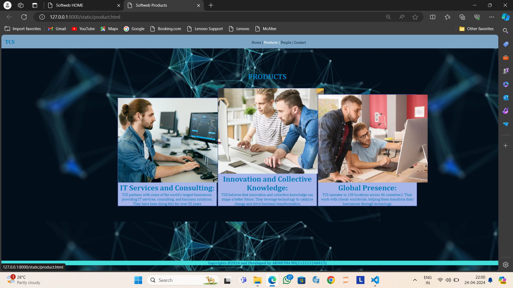
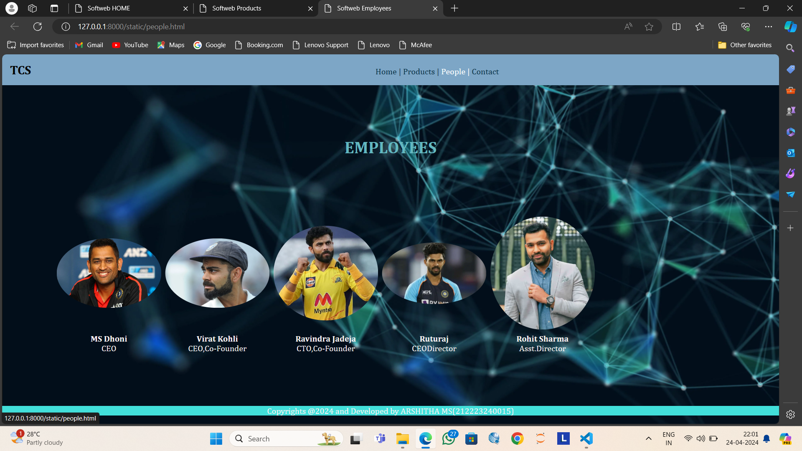
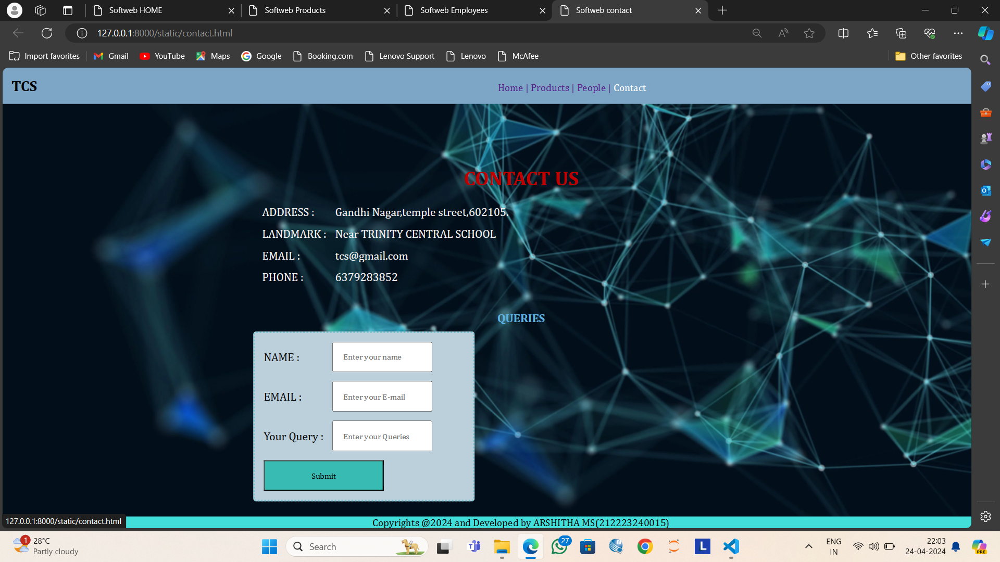

# Ex.07 Software Product Company Website
## Date:24/04/2024

## AIM:
To develop a static company website to display the softwares and services provided by the company.

## DESIGN STEPS:

### Step 1:
Requirement collection.

### Step 2:
Creating the layout using HTML and CSS.

### Step 3:
Updating the sample content.

### Step 4:
Choose the appropriate style and color scheme.

### Step 5:
Validate the layout in various browsers.

### Step 6:
Validate the HTML code.

### Step 7:
Publish the website in the given URL.

## PROGRAM:
### home.html
```
<!DOCTYPE html>
<html lang="en">
<head>
    <meta charset="UTF-8">
    <meta name="viewport" content="width=device-width, initial-scale=1.0">
    <title>Softweb HOME</title>
    <style>
        *{
            margin:0;
            padding:0
        }
        #nav{
            background-color:rgb(125, 166, 198);
            color:#000000;
            padding: 15px;
    
        }
        li,h1,ul{
            display:inline;
        }
        ul{
            margin-left:45%;
        }
        a{
            color:#05334b;
            text-decoration: none;
        }
        a:hover{
            color:rgb(255, 255, 252);
            cursor:pointer;
 }
        input{
            width: 60%;
            padding: 15px;
        }
            .searchbar{
            padding:50px;
            text-align: center;
        }
      
        .box {
            display:inline-block;
            border-style:dotted ;
            border-radius: 10px;
            border-color: rgb(1, 51, 73);
            width: 400px;
            min-height: 300px;
            font-size: 20px;
            background-color:rgb(160, 211, 221);
        
        }
        .heading1{
            color:#000000;
            text-align: center;
            padding-top: 20px;
        }
        .heading2{
            color:#007cb9;
            text-align: justify;
            font-size: 30px;
            margin-left: 30px;
        }
        .edge{
            padding-left: 900px;
        }
        .box{
            text-align: center;
        }
 p{
            color:#000000;
            text-align: center;
        }
    
        .bottomdiv{
 background-color:rgb(166, 223, 218);
            color:#007cb9;
            text-align: center;
            position:relative;
            display:block;
            margin-top: 105px;

        }
        table{
            margin-left: 40px;
        }
    </style>
</head>
<body background="backk.png">
    <div class="header">
        <nav id="nav">
            <h1>
                TCS
            </h1>
                <ul>
                    <li class="li1"> 
                        <a href="home.html" target="_blank">Home  |</a>
                    </li>
                    <li class="li2"> 
                        <a href="product.html" target="_blank">Products  |</a>
                    </li>
                    <li class="li4"> 
                        <a href="people.html" target="_blank">People  |</a>
                    </li>
                    <li class="li5"> 
                        <a href="contact.html" target="_blank">Contact</a>
                    </li>
                </ul>
        </nav>
    </div>
    <div class="searchbar">
    <input placeholder="search">
    </div>
        <div><pre class="heading2"><i><b>
" We are technology, we’re here to change the world."<b></i></pre></div>
        <div class="edge">
            <div class="box">
            <h1 class="heading1">LOGIN HERE</h1>
            <br>
            <br>
            <form>
                <table cellpadding="15px" cellspacing="15px">
                    <tr>
                        <td>
                           <p> Username:</p>
                        </td>
                        <td>
                            <input type="email" name="name" placeholder="Enter a Email">
                        </td>
                    </tr>
                    <tr>
                        <td>
                            <p> Password:</p>
                        </td>
                        <td>
                            <input type="password" name="pwd" placeholder="Enter a Password">
                        </td>
                    </tr>
                    <tr>
                        <td colspan="2">
                            <input type="submit" value="LOGIN" style="background-color: rgb(52, 114, 157); color:white;">
                        </td>
                    </tr>
                </table>
                
            </form>
            </div>
        </div>
    <div class="bottomdiv">
        <p> Copyrights @2024 and Developed by ARSHITHA MS(212223240015)
</body>
<html>
```
### product.html
```
<!DOCTYPE html>
<html lang="en">
<head>
    <meta charset="UTF-8">
    <meta name="viewport" content="width=device-width, initial-scale=1.0">
    <title>Softweb Products</title>
    <style>
        *{
            margin:0;
            padding:0;
            font-family:Cambria, Cochin, Georgia, Times, 'Times New Roman', serif;
        }
        #nav{
            background-color:rgb(125, 166, 198);
            color:#02476a;
            padding: 15px;
    
        }
        li,.heading1,ul{
            display:inline;
        }
        ul{
            margin-left:45%
        }
        li{
            color:#03344d;
        }
        li:hover{
            color:white;
            cursor:pointer;
        }
 input{
            width: 18%;
            padding: 15px;
        }
            .searchbar{
            padding:50px;
            text-align: center;
        }
        .box{
            border-color:rgb(0, 34, 128);
            border-width:2px;
            border-style:solid;
            display: inline-block;
            width: 414px;
        }
        .product{

            text-align: center;
        }
        .box{
            background-color:rgb(166, 182, 234);
            cursor:pointer;
        }
        a{
            color:#062d41;
            text-decoration: none;
        }
        a:hover{
            color:white;
            cursor:pointer;
        }
        .heading2{
            padding-top: 100px;
            padding-bottom: 10px;
            text-align: center;
            color:#007cb9;
        }
      p{
            color:#007cb9;
            text-align: center;
        }
   b{
            width: 300px;
            height: 200px;
        }
    h1{
            color:#007cb9;
            text-align: center;
        }
        .bottomdiv{
 background-color:rgb(66, 223, 218);
            color:#007cb9;
            text-align: center;
            position:relative;
            display:block;
            margin-top: 230px;

        }
    </style>
</head>
<body background="backk.png">
    <div class="header">
        <nav id="nav">
            <h1 class="heading1">TCS</h1>
                <ul>
                    <li class="li1"> 
                        <a href="home.html" target="_blank">Home  |</a>
                    </li>
                    <li class="li2"> 
                        <a href="product.html" target="_blank">Products  |</a>
                    </li>
                    <li class="li4"> 
                        <a href="people.html" target="_blank">People  |</a>
                    </li>
                    <li class="li5"> 
                        <a href="contact.html" target="_blank">Contact</a>
                    </li>
                </ul>
            </nav>
        </div>
        <h1 class="heading2">PRODUCTS</h1>
        <br>
        <div class="product">
            <div class="box">
               <b></b>
                <h1> IT Services and Consulting: </h1>
                <p>
                   
                TCS partners with some of the world’s largest businesses, providing IT services, consulting, and business solutions. They have been doing this for over 55 years</p>
            </div>
            <div class="box">
                
                <h1>Innovation and Collective Knowledge: </h1>
                <p>TCS believes that innovation and collective knowledge can shape a better future. They leverage technology to catalyze change and drive business transformation</p>
            </div>
            <div class="box">
                
                <h1>Global Presence: </h1>
                <p>TCS operates in 150 locations across 46 countries2. They work with clients worldwide, helping them transform their businesses through technology.</p>
        </div>
    </div>
    <div class="bottomdiv">
        <b>Copyrights @2024 and Developed by ARSHITHA MS(212223240015)</b>
    </div>
</body>
</html>
```
### people.html
```
<!DOCTYPE html>
<html lang="en">
<head>
    <meta charset="UTF-8">
    <meta name="viewport" content="width=device-width, initial-scale=1.0">
    <title>Softweb Employees</title>
    <style>
        *{
            margin:0;
            padding:0;
            font-family:Cambria, Cochin, Georgia, Times, 'Times New Roman', serif;
        }
        #nav{
            background-color:rgb(125, 166, 198);
            color:#000000;
            padding: 15px;
    
        }
        li,.heading1,ul{
            display:inline;
        }
        ul{
            margin-left:45%
        }
        li{
            color:#63beeb;
        }
        li:hover{
            color:#fafafa;
            cursor:pointer;
        }
        input{
            width: 60%;
            padding: 15px;
        }
        a{
            color:#053147;
text-decoration: none;
        }
        a:hover{
            color:#ffffff;
            cursor:pointer;
        }
        .heading2{
            padding-top: 100px;
            padding-bottom: 10px;
            text-align: center;
            color:#63b8c0;
        }
        .bottomdiv{
            background-color:rgb(66, 223, 218);
            color:#000000;
            text-align: center;
            position:relative;
            display:block;
            margin-top: 0.7px;

        }
        img{
            border-radius: 50%;
            width: 200px;
            display: inline;
            padding:3px;
            
        }
        .person{
            margin:100px;
            text-align: center;
        }
        b,p{
            color:#faf4f4;
            text-align: center;
        }
      
</style>
</head>
<body background="backk.png">
    <div class="header">
        <nav id="nav">
            <h1 class="heading1">TCS</h1>
                <ul>
                    <li class="li1"> 
                        <a href="home.html" target="_blank">Home  |</a>
                    </li>
                    <li class="li2"> 
                        <a href="product.html" target="_blank">Products  |</a>
                    </li>
                    <li class="li4"> 
                        <a href="people.html" target="_blank">People  |</a>
                    </li>
                    <li class="li5"> 
                        <a href="contact.html" target="_blank">Contact</a>
                    </li>
                </ul>
            </nav>
        </div>
        <h1 class="heading2">EMPLOYEES</h1>
        <table class="person">
            <tr>
                <td>
                    
                </td>
		

                <td>
                    
                </td>
		
                <td>
                   
                </td>
                <td>
                    
                </td>
                <td>
                    
                </td>
            </tr>
            <tr>
                <td>
                    <b>MS Dhoni</b>
                    <p>CEO</p>
                </td>
                <td>
                    <b>Virat Kohli</b>
                    <p>CEO,Co-Founder</p>
                </td>
                <td>
                    <b>Ravindra Jadeja</b>
                    <p>CTO,Co-Founder</p>
                </td>
                <td>
                    <b>Ruturaj</b>
                    <p>CEODirector</p>
                </td>
                <td>
                    <b>Rohit Sharma</b>
                    <p>Asst.Director</p>
                </td>
              
            </tr>
        </table>
    </div>
    <div class="bottomdiv">
<p>Copyrights @2024 and Developed by ARSHITHA MS(212223240015)</p>
    </div>
</body>
</html>
```
### contact.html
```
<!DOCTYPE html>
<html lang="en">
<head>
    <meta charset="UTF-8">
    <meta name="viewport" content="width=device-width, initial-scale=1.0">
    <title>Softweb contact</title>
    <style>
        *{
            margin:0;
            padding:0;
            font-family:Cambria, Cochin, Georgia, Times, 'Times New Roman', serif;
        }
        #nav{
            background-color:rgb(125, 166, 198);
            color:#000000;
            padding: 15px;
    
        }
        li,.heading1,ul{
            display:inline;
        }
        ul{
            margin-left:45%
        }
        li{
            color:#074565;
  }
        li:hover{
            color:white;
            cursor:pointer;
        }
        input{
            width: 60%;
            padding: 15px;
        }
            .searchbar{
            padding:50px;
            text-align: center;
        }
        .box{
            border-color:rgb(254, 253, 253);
            border-width:2px;
            border-style:solid;
            display: inline-block;
            width: 414px;
        }
        .product{

            text-align: center;
        }
        .box{
            background-color:rgb(66, 16, 66);
            cursor:pointer;
        }
        a{
            color:b#007cb9;
            text-decoration: none;
        }
        a:hover{
color:rgb(255, 255, 255);
            cursor:pointer;
        }
        .heading2{
            padding-top: 100px;
            padding-bottom: 10px;
            text-align: center;
            color:#c00000;
        }
        .table1{
            color:rgb(243, 240, 240);
            font-size: large;
        }
        .contact{
            margin-left:400px;
        }
        .heading3{
            padding-top: 30px;
            padding-bottom: 10px;
            text-align: center;
            color:#5eb3e1;
        }
        .table2{
            color:#000000;
            font-size: large;
            background-color:rgb(187, 208, 219);
            border-radius: 5px;
            border-style:dotted;
            border-color: rgb(125, 199, 213);

        }
        .queries{
            margin-left:400px;
        }
        .bottomdiv{
            background-color:rgb(66, 223, 218);
            color:#000000;
            text-align: center;
            position:relative;
display:block;
            margin-top: 24px;

        }
    </style>
</head>
<body background="backk.png">
    <div class="header">
        <nav id="nav">
            <h1 class="heading1">TCS</h1>
                <ul>
                    <li class="li1"> 
                        <a href="home.html" target="_blank">Home  |</a>
                    </li>
                    <li class="li2"> 
                        <a href="product.html" target="_blank">Products  |</a>
                    </li>
                    <li class="li4"> 
                        <a href="people.html" target="_blank">People  |</a>
                    </li>
                    <li class="li5"> 
                        <a href="contact.html" target="_blank">Contact</a>
                    </li>
                </ul>
            </nav>
        </div>
        <h1 class="heading2">CONTACT US</h1>
        <div class="contact">
            <table cellpadding="15px" cellspacing="15px" class="table1">
                <tr>
                    <td>
                        ADDRESS :
                    </td>
                    
                    <td>
                        Gandhi Nagar,temple street,602105.
</td>
                </tr>
                <tr>
                    <td>
                        LANDMARK :
                    </td>
                    <td>
                        Near TRINITY CENTRAL SCHOOL
                    </td>
                </tr>
                <tr>
                    <td>
                        EMAIL :
                    </td>
                    <td>
                        tcs@gmail.com
                    </td>
                </tr>
                <tr>
                    <td>
                        PHONE :
                    </td>
                    <td>
                        6379283852
                    </td>
                </tr>
            </table>
        </div>
        <div>
            <h3 class="heading3">QUERIES</h3>
            <div class="queries">
                <table cellpadding="15px" cellspacing="15px" class="table2">
                    <tr>
                        <td>
 NAME :
                        </td>
                        <td>
                            <input type="name" placeholder="Enter your name"> 
                        </td>
                    </tr>
                    <tr>
                        <td>
                            EMAIL :
                        </td>
                        <td>
                            <input type="email" placeholder="Enter your E-mail">
                        </td>
                    </tr>
                    <tr>
                        <td>
                            Your Query :
                        </td>
                        <td>
                            <input type="text" placeholder="Enter your Queries">
                        </td>
                    </tr>
                    <tr>
                        <td colspan="2">
                            <input type="submit" style="background-color: rgb(55, 187, 178); color:#000000;">
                        </td>
                    </tr>
            </table>
        </div>
        <div class="bottomdiv">
            <p>Copyrights @2024 and Developed by ARSHITHA MS(212223240015)</p>
        </div>
    </div>
</body>
</html>
```


## OUTPUT:





## RESULT:
The program for designing software company website using HTML and CSS is completed successfully.
